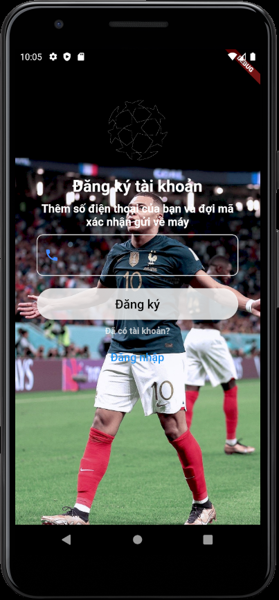
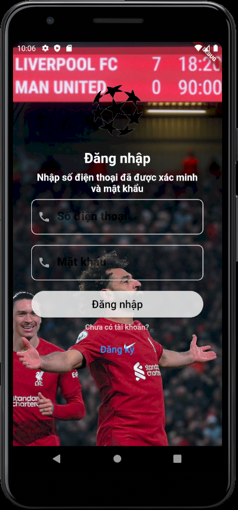
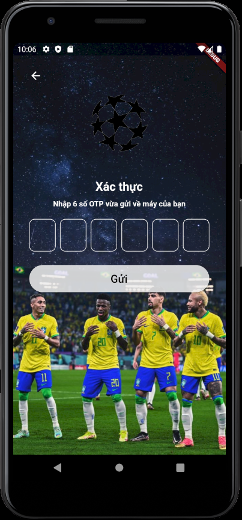
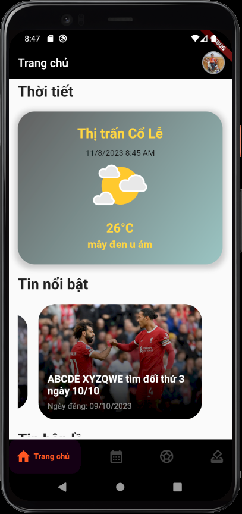
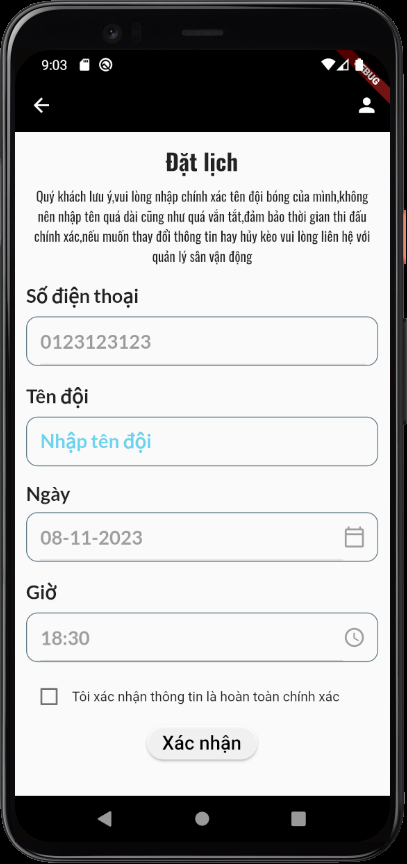
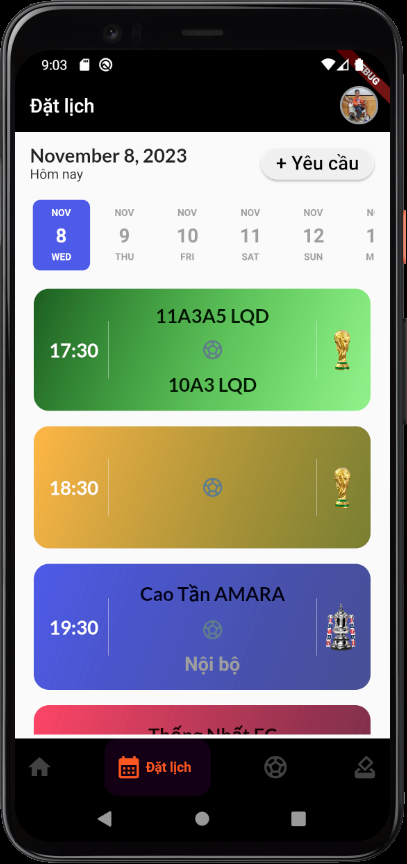
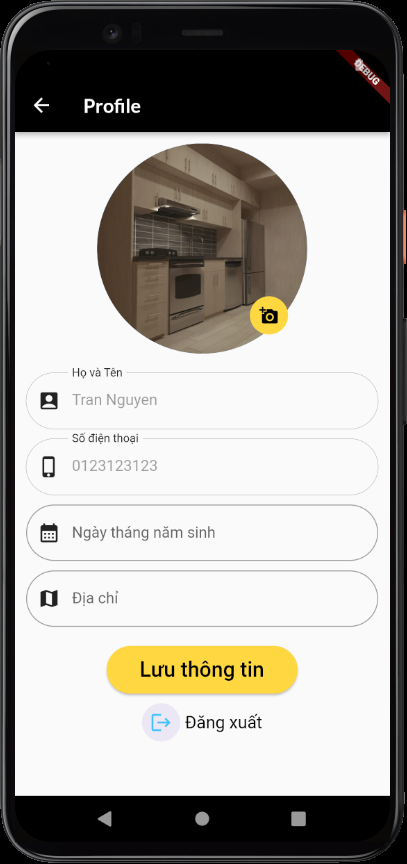

# Booking football schedule
A project to schedule matches at a local soccer field. This is only a draft of the main features. Some outstanding features of the application include registering an account via phone number with OTP code, login via verified phone number, update information user, log out, update stadium news, track match schedules and booking, player information, vote for the best player of the month,...

## App Overview

1. Sign Up
   
2. Login
   
3. Verify OTP
   
4. Home Page
   
5. Booking Page
   
6. Schedule Page
   
7. User Info Page
   

## API Reference
1. Firebase API
2. Openweather API
3. Google Cloud API

## Dependencies
1. Flutter Riverpod
2. Image Picker
3. Firebase Auth
4. Firebase Storage
5. Cloud Firestore
6. Flutter Hooks
7. Google Fonts
8. Date Picker Timeline
9. Intl
10. Uuid

## Operating system
Android, iOS
